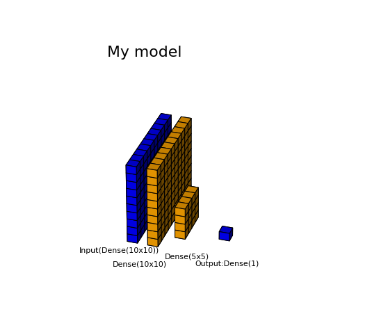

# NND
Neural Networks Designer

 

  

### Repo content
* [dnn_designer](./dnn_designer/), package for designing neural networks.
* [nbs](./nbs/), examples notebooks directory.

### Status

21/01/05 First PoC.  
* There is a first version of [Designer class](./dnn_designer/designer.py), which implements a few methods (very short ones), in order to help to stack the sequential layer renderer. It implements a `Designer.render` method as well, which should take care of everything under the hood.  
A raw example of it is at the end of [first_test.ipynb](./dnn_designer/first_test.ipynb#designer).  
* first tests added for Designer
* Some changes are necessary, to make the development more flexible.
1. currently the translation from layer properties to geometric unit properties is done almost entirely in Designer.render. Example: `'units'` of `Dense` must be translated to `'dims'` of a parallelepiped. This requires varargs in the `add_layers`, to be able to pass upstream different types of layer properties to the Designer. Would it be better with layer small classes, which also preserve the geometric construction function?
2. Everything is currently being squashed on the x-axis. It would be nice to have a proportions management on the space, so as to center the layers.

21/01/01 Beginnning.  
There is a PoC in [first_test.ipynb](./dnn_designer/first_test.ipynb), based on a couple of functions written in [funx.py](./dnn_designer/funx.py).  
The flow i still too much disconnected, must be adjusted to be more dev friendly.
  

##### Issues
1. A dev should not pass by the (2) step
2. plotting should be more user friendly, accepting angle as well.
3. Adding labels should be flaggable and automatically done.

